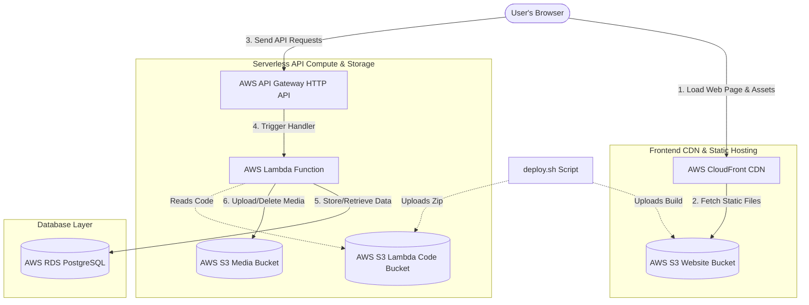
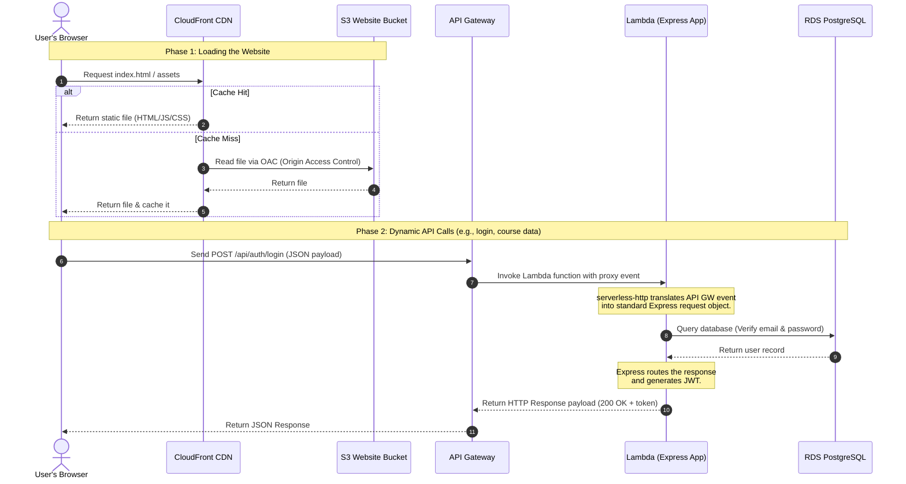
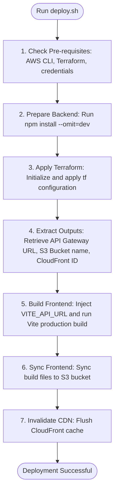

# AWS Deployment and Terraform Setup Walkthrough

This walkthrough outlines the cost-optimized, serverless architecture on AWS and the automated Terraform setup used for the deployment of **TernKonnect**.

---

## 🏛️ System Architecture Flow

The application is deployed using a fully automated, serverless architecture on AWS. It separates the static frontend assets from the dynamic backend API compute and database storage to achieve high scalability, security, and low cost.

### Architecture Diagram

---

## 🔁 Request Lifecycle Flow

Here is the step-by-step walkthrough of how requests flow through the infrastructure:

---

## 🛠️ Infrastructure Component Breakdown

### 1. Frontend Hosting (S3 + CloudFront)
* **AWS S3 Bucket**: Houses the static React production build (Vite compilation assets). Public access block is turned **on** to secure the bucket.
* **AWS CloudFront Distribution**: Serves as the CDN. It accesses the private S3 bucket securely using **Origin Access Control (OAC)**. It enforces HTTPS and routes traffic globally with low latency.
* **SPA Routing Fallback**: CloudFront is configured with custom error responses for `404` and `403` errors. Instead of failing, it rewrites these statuses to `200` and returns `index.html`. This allows client-side React Router to handle page routing dynamically.

### 2. Backend Compute (AWS Lambda + API Gateway)
* **AWS Lambda Function**: Runs the Express.js application inside the `nodejs22.x` runtime. It is packaged as a `.zip` file containing only production dependencies.
* **`serverless-http` Adapter**: Since AWS Lambda expects an event-driven JSON structure, we use the `serverless-http` adapter in `lambda.js` to translate incoming API Gateway proxy payloads into standard Express request/response streams.
* **AWS API Gateway (HTTP API)**: Acts as the entry point for the backend. It defines a wildcard `$default` route that forwards all incoming methods (`GET`, `POST`, etc.) and paths (`/*`) directly to the Lambda function.

### 3. Database Layer (AWS RDS PostgreSQL)
* **AWS RDS PostgreSQL Instance**: Uses a minimal `db.t4g.micro` database with 20GB of General Purpose SSD storage.
* **Network & Cost Optimization**: To avoid the high cost of an AWS NAT Gateway (~$32+/month), both the RDS instance and the Lambda function are configured as follows:
  * RDS runs with `publicly_accessible = true`.
  * Inbound connections are strictly restricted to SQL port `5432` and secured with a strong randomly generated password.
  * Lambda runs outside the VPC. This gives it direct outbound internet access (needed to interact with external providers like Cloudinary or GitHub integrations) without requiring an expensive NAT Gateway setup.

### 4. Media Storage (AWS S3)
* **AWS S3 Media Bucket**: Houses user-uploaded files, course assets, and attachments.
* **Access Permissions**: Securely accessed by the Lambda function. The Lambda Execution Role contains explicit IAM policy statements granting access for `s3:PutObject`, `s3:GetObject`, and `s3:DeleteObject` operations.
* **Hybrid Storage Strategy**: In production (`NODE_ENV=production`), the application uses this S3 bucket for media handling, requesting pre-signed URLs for secure client uploads/downloads. In development, it falls back to Cloudinary.

---

## 🚀 Automated Deployment Flow (`deploy.sh`)

The deployment process is managed by `deploy.sh` to ensure consistent builds and zero-downtime updates:

### Detailed Deployment Actions

1. **Verification**: Validates that Terraform and AWS CLI are installed and that valid credentials exist on the terminal (`aws sts get-caller-identity`).
2. **Backend Packing**: Prepares backend code by installing only production modules, excluding dev modules (like `nodemon`), and zips the files up (excluding the infrastructure directory itself).
3. **Terraform Apply**: Runs `terraform apply -auto-approve` which handles:
   * Zipping the backend.
   * Uploading the zip to a private code bucket (`aws_s3_bucket.backend_code`).
   * Provisioning the RDS instance and configuring Security Groups.
   * Creating/Updating the Lambda function and configuring API Gateway HTTP endpoint.
   * Creating/Updating the S3 bucket for the website and CloudFront distribution.
4. **Vite Build**: Sets the environment variable `VITE_API_URL` to the freshly generated API Gateway Invoke URL and runs the Vite build script (`npm run build`).
5. **Sync to S3**: Performs `aws s3 sync` from the local `dist/` directory to the website S3 bucket, using the `--delete` flag to prune deleted files.
6. **CDN Cache Invalidation**: Generates a CloudFront invalidation request (`/*`) so users immediately receive the new code version instead of cached assets.
